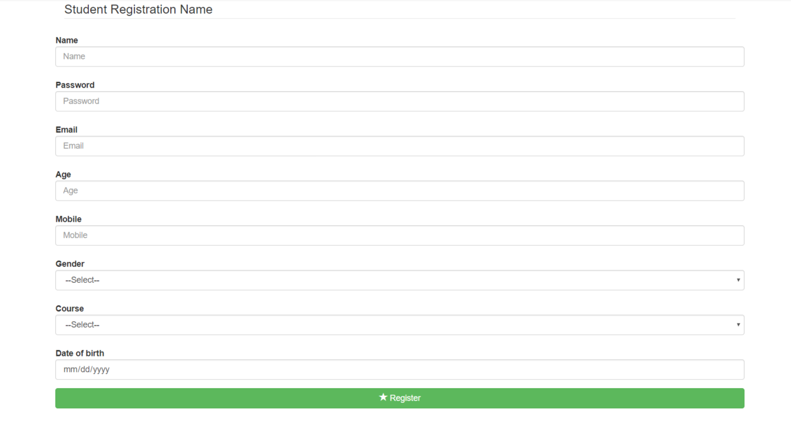
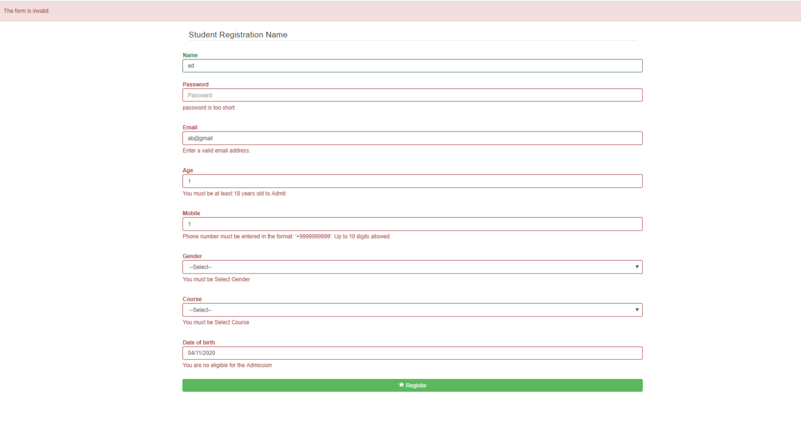

# DJango form Customization and Validation :

 Before & After submitting data to the server, it is important to ensure all required form controls are filled out, in the correct format. 

# What is Internationalization?
Go to any popular site with a registration form, and you will notice that they provide feedback when you don't enter your data in the format they are expecting. You'll get messages such as:

 * "This field is required" (You can't leave this field blank).
 * "Please enter your phone number in the format xxx-xxxx" (A specific data format is required for it to be considered valid).
 * "Please enter a valid email address" (the data you entered is not in the right format).
 * "Your password needs to be between 8 and 30 characters long and contain one uppercase letter, one symbol, and a number." (A very specific data format is required for your data).
 
 This is called form validation. When you enter data, the browser and/or the web server will check to see that the data is in the correct format and within the constraints set by the application. Validation done in the browser is called client-side validation, while validation done on the server is called server-side validation. In this chapters we are focusing on client-side validation.

# Project Setup

  - Making the project as :
     ```
     mkdir django_form_validation_example
	    cd django_form_validation_example
    ```
  - Install Django:
    ```
    pip install django
    ```
  - Make apps (for class based views)
    ```
    django-admin startapp django_form_customization_and_validation
    ```
 - Add 'django_form_validation_example' apps to settings.py as:
    ```
    INSTALLED_APPS = [
				...
				'django_form_customization_and_validation',
	   ]
    ```
 
 - Make a view
     ``` 
   def indexView(request):
    if request.method == 'POST':
        form = StudentForm(request.POST)
        if form.is_valid():
            messages.success(request, 'The form is valid.')
        else:
            messages.error(request, 'The form is invalid.')

        return render(request, 'index.html', {'form': form})

    else:
        form = StudentForm()
        return render(request, 'index.html', {'form': form})
    ```
 - Create templates/index.html as follow : 
     ``` 
        
    <head>
        
        
        
    </head>
    <div class="container">
        <form class="form-horizontal" method="post" action="/">
            <fieldset>
    
                <!-- Form Name -->
                <legend>Student Registration Name</legend>
                
                
                
                <button type="submit" class="btn btn-success btn-block"> Register</button>
                
            </fieldset>
        </form>
    </div>
     ``` 
 - Create form for customized the validation   
    
     ``` 
     Please check forms.py file for that.
      ``` 
     
 - In order to run the it apply migrations to make tables in db against models and runserver to test:
      ```
	  python manage.py runserver
      ```

 - python manage.py runserver
    * Your should run at: http://127.0.0.1:8000/

  ### Output like this :
   
   
   
  